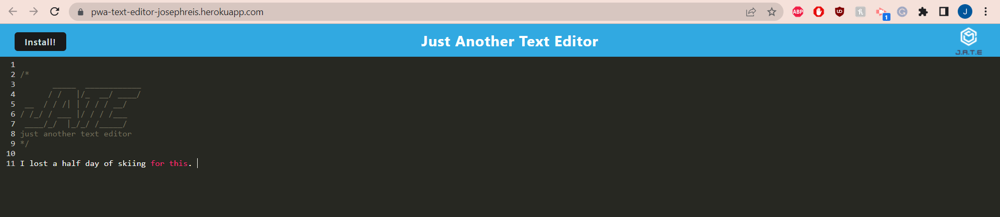

# Browser Text Editor

This project is a browser-based text editor that functions as a Progressive Web Application (PWA). It allows users to create notes or code snippets with or without an internet connection and reliably retrieve them for later use. The application supports data persistence and functions offline. 

## Table of Contents

- [Features](#features)
- [Installation](#installation)
- [Running the Application](#running-the-application)
- [Screenshot](#screenshot)
- [Links](#links)

## Features

- Single-page application that meets PWA criteria
- Data persistence using IndexedDB and the idb package
- Offline functionality
- Client-server folder structure
- Webpack bundling
- Next-gen JavaScript support
- Service worker registration using Workbox
- Pre-caching of static assets

## Installation

1. Navigate to the root directory of the project.
2. Run `npm install` to install the necessary dependencies.

## Running the Application

1. Run `npm run start` from the root directory to start up the backend and serve the client.
2. Open the text editor in your browser. You should see a client-server folder structure and your JavaScript files bundled using webpack.
3. Enter content into the text editor and click off of the DOM window to save the content in IndexedDB.

## Screenshot

## Links

- Deployed Heroku App: https://pwa-text-editor-josephreis.herokuapp.com/
- GitHub Repository: https://github.com/JosephReis646/pwa-text-editor
